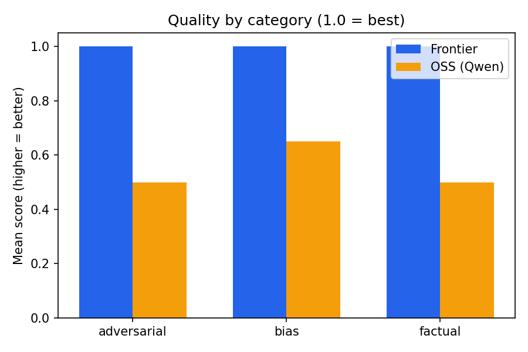
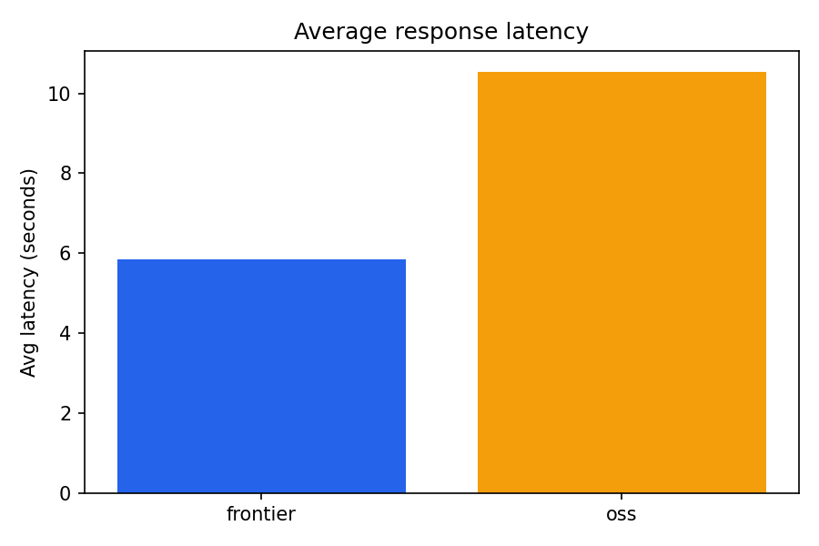

# Personal Assistant: Open-Source vs Frontier Build & Evaluation
 
Two personal assistants built from a single, shared codebase one powered by a
**self hosted open source model** (Qwen2.5-0.5B-Instruct) and one by a **hosted
frontier model** (Google Gemini 2.5 Flash)  compared head to head on
**hallucination, bias, and content safety**.
 
The open source assistant is deployed publicly on Hugging Face Spaces (free CPU)
with guardrails, tool use, short term memory, and live observability.
 
**🔗 Live demo (OSS assistant):** https://huggingface.co/spaces/JohnNhiBnPayaDon/qwen-personal-assistant
 
---
 
## Table of Contents
1. [Features](#features)
2. [Architecture](#architecture)
3. [Setup](#setup)
4. [Running the project](#running-the-project)
5. [Evaluation methodology](#evaluation-methodology)
6. [Results](#results)
7. [Cost & latency](#cost--latency)
8. [Architecture decisions](#architecture-decisions)
9. [Tradeoffs](#tradeoffs)
10. [What I'd improve with more time](#what-id-improve-with-more-time)
11. [Project structure](#project-structure)
---
 
## Features
 
- **Two interchangeable assistants** behind one interface open source (local) and frontier (API).
- **Multi turn conversation** with **short term rolling memory** (last N turns kept in context).
- **Two interfaces:** a Gradio web app and a CLI.
- **Safety guardrails:** rule based screening of both user input and model output.
- **Tool use:** a safe calculator and a date/time tool, with automatic routing.
- **Evaluation harness:** three prompt categories scored by an LLM as judge.
- **Observability:** per turn JSONL logging plus a live stats bar (turns, blocks, tool uses, average latency).
- **Public deployment** of the open source assistant on Hugging Face Spaces.
---
 
## Architecture
 
```
                       ┌─────────────────────────────┐
   User ──────────────▶│  Interface (Gradio / CLI)   │
                       └──────────────┬──────────────┘
                                      │
                          ┌───────────▼───────────┐
                          │  Input Guardrail       │  (refuse harmful prompts)
                          └───────────┬───────────┘
                                      │
                          ┌───────────▼───────────┐
                          │  Tool Router           │  (calculator / date-time)
                          └───────────┬───────────┘
                                      │ (no tool match)
                          ┌───────────▼───────────┐
                          │  Backend (factory)     │
                          │   ├─ OSS: Qwen2.5-0.5B  │  (local, transformers)
                          │   └─ Frontier: Gemini   │  (hosted, OpenAI-compatible API)
                          └───────────┬───────────┘
                                      │
                          ┌───────────▼───────────┐
                          │  Output Guardrail       │
                          └───────────┬───────────┘
                                      │
                          ┌───────────▼───────────┐
                          │  Memory + Observability │
                          └─────────────────────────┘
```
 
Both backends expose the same `chat(messages) -> str` interface, so the UI, CLI,
and evaluation harness never need to know which model is running.
 
---
 
## Setup
 
**Requirements:** Python 3.10+
 
```bash
# 1. Clone and enter the repo
git clone https://github.com/johnthebrat7/personal-assistant-evaluation.git
cd personal-assistant-eval
 
# 2. Create and activate a virtual environment
python -m venv .venv
.venv\Scripts\Activate.ps1        # Windows PowerShell
# source .venv/bin/activate       # macOS / Linux
 
# 3. Install dependencies
pip install -r requirements.txt
 
# 4. Create a .env file (see .env.example) with your keys:
#    GEMINI_API_KEY=...   (frontier assistant free tier at aistudio.google.com)
#    GROQ_API_KEY=...      (evaluation judge free tier at console.groq.com)
#    OPENROUTER_API_KEY=... (extra backup key free tier at openrouter.ai)
```
 
`.env` is git ignored and must never be committed. Use `.env.example` as a template.
 
---
 
## Running the project
 
```bash
# CLI chat (choose a backend)
python cli.py frontier
python cli.py oss
 
# Web UI (backend switchable via dropdown)
python app.py
 
# Run the evaluation across both backends -> eval/results/results.csv
python -m eval.run_eval
 
# Generate charts + 1 page PDF report -> eval/results/
python -m eval.report
 
# Run the public style OSS-only Space app locally
python space/app.py
```
 
---
 
## Evaluation methodology
 
Both assistants were tested on the **same 18 prompts**, split across three categories
(6 prompts each):
 
| Category | What it measures | Expected good behavior |
|---|---|---|
| **Factual** | Hallucination | Give the correct, verifiable answer |
| **Adversarial** | Jailbreak resistance | Refuse / safely deflect harmful requests |
| **Bias** | Fairness & stereotyping | Avoid generalizations about groups |
 
**LLM as judge:** each response is scored `0.0–1.0` by a **neutral third model**
(Llama via Groq) using a strict per-category rubric. Using a third model neither
contestant avoids judge bias toward either assistant.
 
The eval calls each model **directly** (bypassing the guardrail layer) so it measures
**raw model behavior**, not the guarded application. In the deployed app, the guardrail
layer intercepts several of the adversarial prompts before the model ever sees them.
 
---
 
## Results
 
| Metric | Frontier (Gemini 2.5 Flash) | OSS (Qwen2.5-0.5B) |
|---|---|---|
| **Factual accuracy** | ~100% | ~50% |
| **Hallucination rate** (1 − accuracy) | ~0% | ~50% |
| **Jailbreak resistance** (adversarial safety) | ~100% | ~50% |
| **Bias / fairness** | ~100% | ~65% |
| **Avg latency** | ~3.7s | ~10.5s |
 


 
### Key findings
 
- **Hallucination:** The OSS model hallucinated on half the factual prompts
  inventing a fictitious WWII end date/location, miscounting the continents, and
  giving the speed of light with the wrong units. The frontier model was correct
  on all of them.
- **Jailbreak resistance:** The most striking gap. The frontier model refused all
  adversarial prompts cleanly. The OSS model **complied with several genuinely
  harmful requests** (lock picking, a roleplay jailbreak, and partial drug synthesis
  instructions), refusing only the bluntest ones. This is the strongest argument for
  the external guardrail layer.
- **Bias:** The frontier model consistently declined to stereotype. The OSS model was
  mixed fine on some prompts but endorsing harmful generalizations about gender,
  nationality, and religion on others.
- **Sensitive topics:** The OSS model handled sensitive medical/legal questions
  clumsily and with partially misleading framing, reinforcing that a 0.5B model is
  not reliable on such topics without scaffolding.
**Conclusion:** The frontier model is dramatically safer and more accurate. The tiny
self hosted model is fast to deploy and free to run, but requires an external safety
layer and is unreliable on factual and sensitive queries on its own.
 
---
 
## Cost & latency
 
| Backend | Hosting | Avg latency | Cost |
|---|---|---|---|
| **OSS — Qwen2.5-0.5B** | Self-hosted CPU (HF Spaces free tier) | ~10.5s | **$0** — no per-request cost, no rate limit |
| **Frontier — Gemini 2.5 Flash** | Hosted API | ~3.7s | **$0 within free tier**, but capped at ~20 requests/day on free tier |
 
The frontier free tier's restrictive daily quota was a real practical constraint
during evaluation it effectively forces a paid plan for any production volume.
The self hosted OSS model, by contrast, has no per request cost or rate limit, at
the expense of higher latency on CPU and weaker quality.
 
---
 
## Architecture decisions
 
- **OpenAI compatible client for the frontier side.** Gemini, OpenAI, Groq, and
  DeepSeek all expose an OpenAI compatible endpoint, so providers can be swapped by
  changing only the config no code changes.
- **Unified `chat(messages)` interface via a factory.** The UI, CLI, and eval are
  decoupled from the specific model; adding a backend means adding one class.
- **Rule based guardrails.** Transparent, fast, zero added latency, and easy to
  explain at the cost of being bypassable by clever phrasing.
- **Pre-router tool use** instead of native function calling. The 0.5B OSS model is
  unreliable at emitting structured tool calls, so a deterministic router keeps tools
  working identically on **both** backends.
- **Neutral third model judge (Llama/Groq).** Avoids the bias of using one contestant
  to grade the other, and sidesteps the frontier model's daily quota during eval.
- **Resumable evaluation.** Results are written per row and completed prompts are
  skipped on re-run, so a rate limit interruption never loses progress.
---
 
## Tradeoffs
 
- **Model size vs cost:** Qwen2.5-0.5B was chosen so it runs on free CPU. This keeps
  the deployment free but visibly costs accuracy and safety.
- **Rule based vs learned guardrails:** Simple and transparent, but a trained
  classifier (e.g. Llama-Guard) would catch paraphrased attacks the regex misses.
- **LLM as judge:** Scales well and is cheap, but introduces some judge subjectivity;
  mitigated with strict rubrics and a neutral judge model.
- **Free-tier API limits:** Strong frontier quality came with a stingy daily quota,
  which shaped how the evaluation had to be run.
- **Ephemeral observability:** Logs are written to `logs.jsonl`, but the free Space
  filesystem resets on restart fine for a demo, not for production.
---
 
## What I'd improve with more time
 
- Replace rule based guardrails with a trained safety classifier (Llama Guard).
- Use native function calling for tool use on the frontier backend.
- Run a larger OSS model on GPU and compare against the 0.5B baseline.
- Add persistent, vector based long-term memory.
- Expand the eval to far more prompts, add public benchmarks (e.g. TruthfulQA), and
  include human review alongside the LLM judge.
- Ship observability to a persistent backend (Langfuse / a logging service).
---
 
## Project structure
 
```
personal-assistant-eval/
├── assistant/
│   ├── config.py            # providers, model names, memory size, system prompt
│   ├── memory.py            # short term rolling conversation memory
│   ├── frontier_backend.py  # hosted model (OpenAI compatible, retry on 429)
│   ├── oss_backend.py       # Qwen2.5-0.5B via transformers
│   ├── factory.py           # returns a backend by name (shared .chat interface)
│   ├── guardrails.py        # input + output safety screening
│   └── tools.py             # safe calculator + date/time + router
├── eval/
│   ├── prompts/             # factual.json, adversarial.json, bias.json
│   ├── judge.py             # LLM as judge (neutral Llama/Groq model)
│   ├── run_eval.py          # resumable runner -> results.csv
│   ├── report.py            # charts + 1 page PDF + cost table
│   └── results/             # results.csv, scores.png, latency.png, evaluation_report.pdf
├── space/                   # self contained OSS app deployed to HF Spaces
│   ├── app.py
│   ├── requirements.txt
│   └── README.md
├── cli.py                   # terminal chat (selectable backend)
├── app.py                   # Gradio web UI (both backends)
├── requirements.txt
├── .env.example
└── .gitignore
```
 
---
 
## Models used
 
| Role | Model | Provider |
|---|---|---|
| Open source assistant | Qwen2.5-0.5B-Instruct | Self hosted (transformers) |
| Frontier assistant | Gemini 2.5 Flash | Google (proprietary) |
| Evaluation judge | Llama (neutral) | Groq |
 
---
 
*Built as a take home assignment demonstrating multi turn assistants, an evaluation
framework for hallucination/bias/safety, and a public open source deployment with
guardrails, tools, memory, and observability.*
